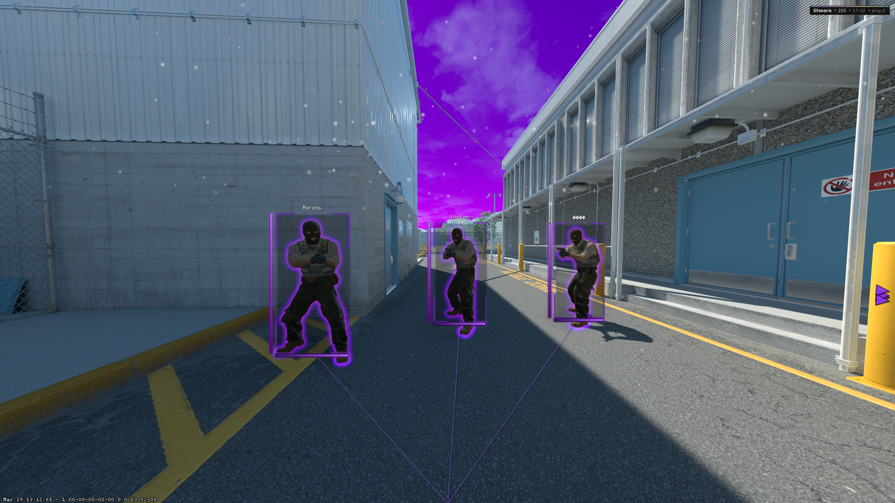
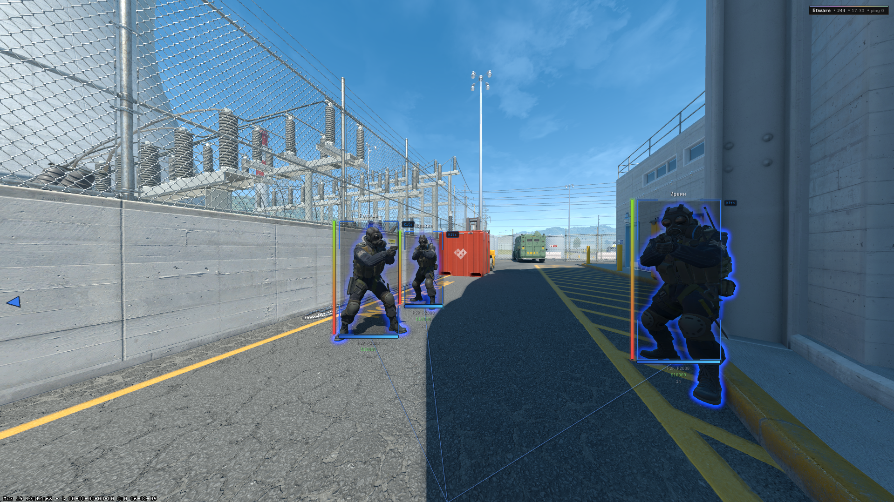
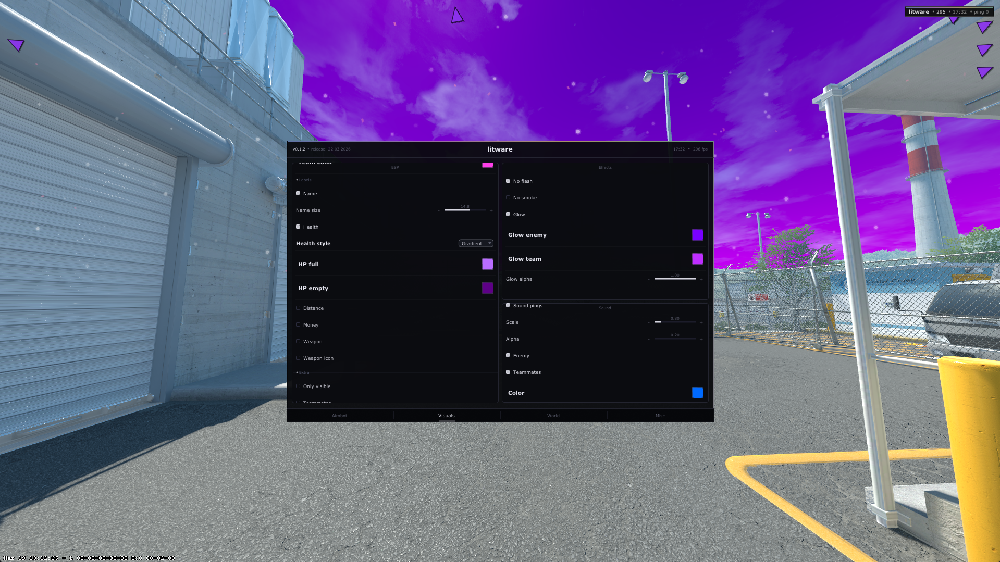

# LitWare CS2 Internal

Internal cheat for Counter-Strike 2. The DLL is injected into `cs2.exe`, hooks DirectX 11 `Present`, and renders an ImGui overlay directly in-game.

| | |
|---|---|
| Platform | Windows x64 |
| Engine | Source 2 |
| Build | Visual Studio 2022 |
| Dependencies | Steam (`gameoverlayrenderer64.dll`), ImGui, MinHook, omath (`vendor/omath`) |
| License | MIT |

---

## Screenshots

| 1 | 2 | 3 |
|:--:|:--:|:--:|
|  |  |  |

---

## Features

| Category | Features |
|----------|----------|
| ESP | Boxes, skeleton, health bar, names, weapons, ammo, money, distance, offscreen arrows |
| Aimbot | FOV, smoothing, head bone, team check, optional crosshair-only target mode |
| Visuals | No flash, no smoke, glow, chams, world/sky color, snow, sakura |
| Movement | Bunny hop, strafe helper, anti-aim |
| Misc | FOV changer, radar, bomb timer, spectator list |
| Config | Save/load to `%APPDATA%\litware\` |

---

## Controls

| Key | Action |
|-----|--------|
| `INSERT` | Toggle menu |
| `END` | Unload DLL |

---

## Build

### Prerequisites

- Visual Studio 2022
- Steam running with `gameoverlayrenderer64.dll`
- Counter-Strike 2 installed

### Steps

1. `git clone --recurse-submodules --remote-submodules https://github.com/t3rmynal/cs2-litware-internal.git`
2. Open `litware-dll/litware-dll.vcxproj` in Visual Studio
3. Select `Release | x64`
4. Build to `litware-dll/bin/Release/litware-dll.dll`
5. Inject into `cs2.exe` after the main menu loads

### Dependencies (submodules)

- `litware-dll/external/imgui`
- `litware-dll/external/minhook`
- `vendor/omath`

---

## Configs

- Directory: `%APPDATA%\litware\`
- Format: plain-text `*.cfg`
- Save/load is handled from the in-game Config section

---

## Offsets

Offsets are stored in `litware-dll/src/core/offsets.h` and synced from `cs2-dumper`.

After game updates:

1. Refresh `offsets/output/`
2. Run `python3 offsets/update_offsets.py`
3. Rebuild the DLL

---

## Notes

- The DLL does not use a runtime offset downloader.
- Steam Overlay must stay enabled.
- The current build uses embedded font fallbacks and bundled assets from the repository.

---

Use at your own risk. Game- or platform-side sanctions are possible.
